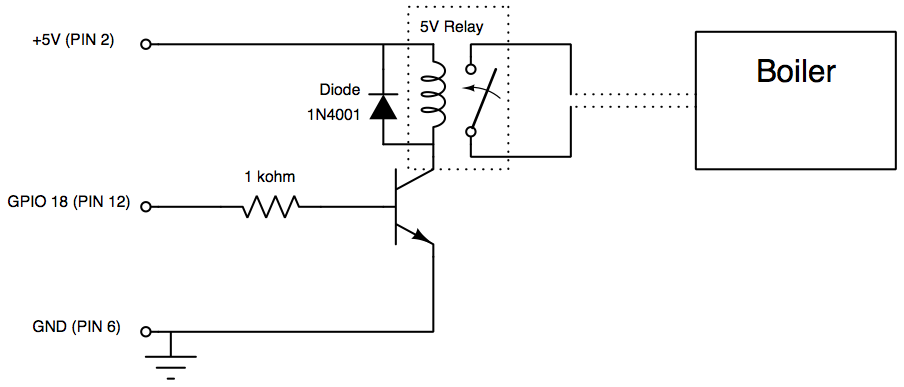

Home Temperature
================
Use a Raspberry Pi to read the temperature from a sensor, store it and show some graphs. Then a thermostat software is used to switch on/off a boiler, so a constant target temperature can be mantained at home.


Hardware
========

Electronics
-----------
### Temperature sensor circuit


### Switch circuit


Boxing
------
Coming soon


Software
========

Installation
------------
Install MySQL DB:
```
sudo apt-get install mysql-server
sudo apt-get install libmysqlclient-dev

mysql -u root -p

create database home_temperature;
create user 'home'@'localhost' identified by 'temperature';
grant all privileges on home_temperature.* TO 'home'@'localhost' identified by 'temperature';
```

Load 1-wire bus kernel modules:
```shell
sudo modprobe w1_gpio 
sudo modprobe w1_therm
```

For loading the modules at boot time:
```shell
sudo vi /etc/modules
w1_gpio
w1_therm
```

```shell
sudo vi /boot/config.txt
dtoverlay=w1-gpio
```


Install python libraries and run the server
```shell
sudo apt-get install python-pip
sudo pip install virtualenv

git clone https://github.com/smallo/home-temperature
cd home-temperature

virtualenv ./tmp/venv/home-temperature
source ./tmp/venv/home-temperature/bin/activate
pip install -r requirements.txt 
python manage.py syncdb
python manage.py loaddata temperature/fixtures/configuration.json
```


Executing
---------
*Live*:
```
sudo su
./runserver.sh
./take_samples.sh
```

Note:
* sudo it's required by RPi.GPIO

*Development environment* (sqlite instead of MySQL and uses mocks for temperature reader and GPIO):
`python manage.py runserver --setting=home_temperature.settings_dev`

Or if you want to listen to all network interfaces:
`python manage.py runserver 0.0.0.0:8000 --setting=home_temperature.settings_dev`


Boot scripts
------------
In order to runserver and take_samples to run when the system starts up:

```
sudo su
cp ./scripts/home-temperature-runserver /etc/init.d
update-rc.d home-temperature-runserver defaults

cp ./scripts/home-temperature-take-samples /eyc/init.d
update-rc.d home-temperature-take-samples defaults
```


URLs
----
 - http://erio.dyndns.org/temperature
 - http://localhost:8000/temperature
 - http://localhost:8000/admin
